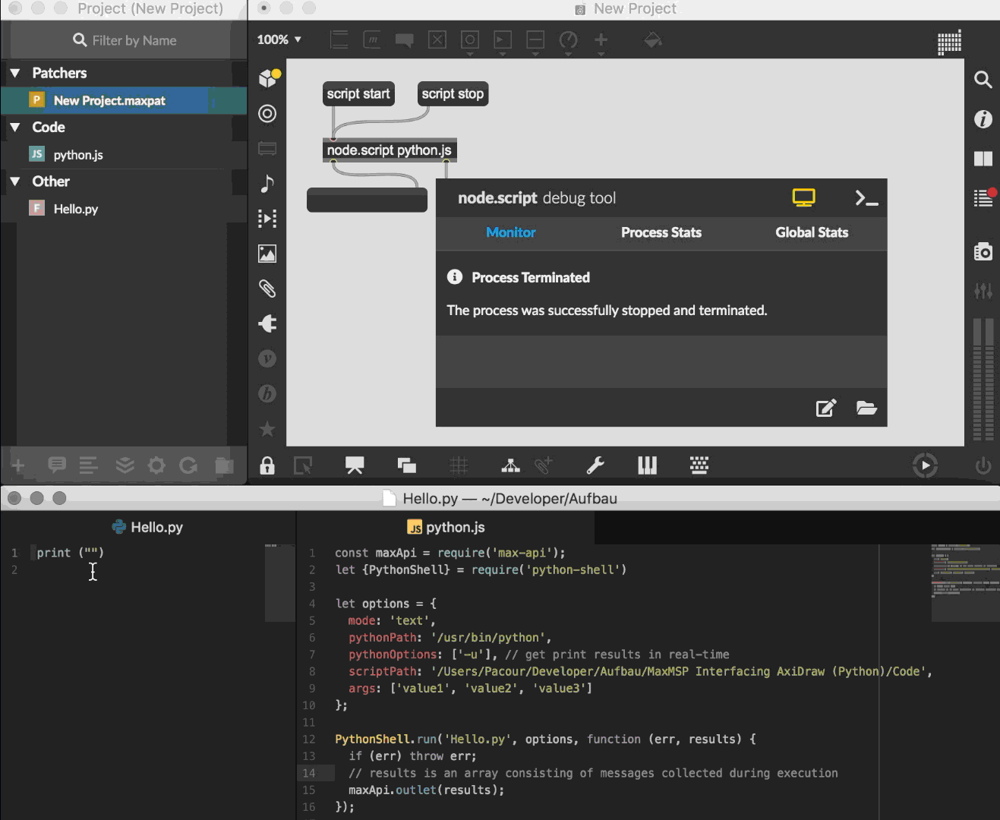
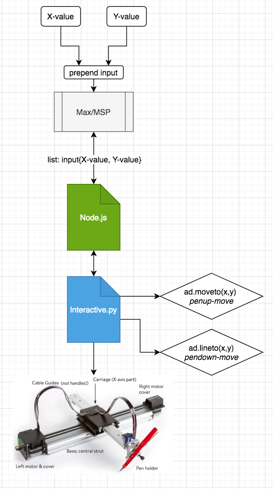

# MaxMSP Interfacing AxiDraw (Python)
The word "Interfacing" is here primarily understood as a process of establishing interoperational constitution between Max/MSP and other programming languages. In this part we will examine the interfacing between Max/MSP and an AxiDraw XY plotter through Python.


## Set-up

In this guide I assume that the reader has already worked with AxiDraw through the inkscape software, and is familiar with using it to plot .svg. Thus we wont be covering all of the necessary first time quick setup which is covered extensivly throughout this [guide](https://cdn.evilmadscientist.com/dl/ad/public/AxiDraw_Guide_v40_r3.pdf)

On page 17 of the guide, the reader will have come accross "3.3 Aside: Alternative software, CLI, and API's". in this section, it becomes apparent to the user of the AxiDraw that there are other ways of controlling the plotter than using inkscape.

There is a stand-alone command-line interface (CLI) tool, as well as a full-featured python library. You can learn more about these tools at:

[CLI](https://axidraw.com/doc/cli_api/#introduction)

[Python](https://axidraw.com/doc/py_api/#introduction)

In this guide we will mainly be focusing on using the python library to control the AxiDraw, and try to combine the python library with Max/MSP.

[Download](https://cdn.evilmadscientist.com/dl/ad/public/AxiDraw_API.zip) and unzip this folder on your computer.

In the unzipped folder there is another named "AxiDraw_API_v256" where the rest of the elements are located for using python with Axidraw.

### Installing the Python-AxiDraw-Api

- Install [Python](https://www.python.org/downloads/ ) on your computer if you don't already have it available. This can be checked by typing in "python --version" into your Terminal or CMD.
- You will also need to have Pip installed which is Pythons package manager. Again you can check if you already have this on your computer by typing "pip --version" into your terminal or CMD.
  - if pip is not installed you can type in "sudo easy_install pip" into your terminal or CMD. This will install pip on your computer

### Installing dependencies

- Use pip to install pyaxidraw og axicli
  - in Terminal or CMD write
    "cd /Users/username/Documents/axidraw-api/  (Your location and path will vary)"
  - write "pip install"
  - write "pip install -r requirements.txt"

#### Python interactive

open /AxiDraw_API_v256/test_Interactive.py in a text-editor that can run python-scripts. in this guide I will be using ATOM.

```python
from pyaxidraw import axidraw   # import module
ad = axidraw.AxiDraw()          # Initialize class
ad.interactive()                # Enter interactive context
ad.connect()                    # Open serial port to AxiDraw
                                # Absolute moves follow:
ad.moveto(1,4)                  # Pen-up move to (1 inch, 1 inch)
ad.lineto(2,1)                  # Pen-down move, to (2 inch, 1 inch)
ad.moveto(0,0)                  # Pen-up move, back to origin.
ad.disconnect()                 # Close serial port to AxiDraw
```


Connect your computer and power-cable to the plotter and compile the python script.

If you have installed and connected everything correctly then you should see the plotter move. If not go back and check that everything has been done according to the installation guide.

The question is now, how can we connect the Python script to Max/MSP in a way that makes sense?

In order to establish a connection between max/MSP and python we need to use the Node for max framework and an npm package called [python-shell](https://www.npmjs.com/package/python-shell) which can be installed by writing "npm install python-shell" in the terminal or CMD

then we must create two files a Hello.py, and a javascript file containing the necessary code to establish a connection we will call this python.js.

Hello.py contains

```python
import sys

# defining X/Y for pen-up and pen-down
xlin = sys.argv[1]
ylin = sys.argv[2]
xmov = sys.argv[3]
ymov = sys.argv[4]


print("Pen-Down", xlin, ylin) #ad.lineto(x,y)

print("Pen-Up",xmov, ymov) #ad.moveto(x,y)
```

python.js contains

```js
const maxApi = require('max-api');
let {
  PythonShell
} = require('python-shell')

let args = 'insert';

maxApi.addHandler('input', (xlin, ylin, xmov, ymov) => {
  //maxApi.outlet(vari);

  let options = {
    mode: 'text',
    pythonPath: '/Library/Frameworks/Python.framework/Versions/3.8/bin/python3',
    pythonOptions: ['-u'], // get print results in real-time
    scriptPath: '/Users/Pacour/Developer/Aufbau/MaxMSP Interfacing AxiDraw (Python)/Code',
    args: [xlin, ylin, xmov, ymov]
  };

  PythonShell.run('Interactive.py', options, function(err, results) {
    if (err) throw err;
    //results is an array consisting of messages collected during execution
    maxApi.outlet(results);
  });
});
```

Now that the files are done we can move on to the max-patcher.

- make a new patcher, and save it as a project within the folder where the other .js and .py scripts are located.



<details>
  <summary>Max/MSP patcher</summary>
<pre><code>
----------begin_max5_patcher----------
1619.3ocyZs0iaZDE9Y6eEi3oTIuTlKbKUpJQMu1pHUUoV0TYgsGu6jEyffw
d81n7euyEvKNKFyU23UKBFF3b9ly8yvWlOyZE+HM2B7VveClM6KymMSOjZfY
EWOyZWzw0wQ45oYsluaGMQXsvbOA8nPO9uvSx4wzxwS1uiuWDSE5mxoXzzHw
5GXI2uLitVXnpmcP0et9K.n.ns6B.DGXCq9ifk2yw1A7OEuN1FMo4q97cPGb
ERyRJoLTM1WmOWcXQKgXB8I4q7UHLC7QZxc6SqGhvKCQHoFP5FZ6HO5pNhPU
.k4cJdNkZdZKq5wKrV75Ld3MuQ71fHkHEbHo.zM.qwn+qv3Y.wYzDbq1KD7j
NKeNwuDizfTd7xxjUQI2WqbILz5Dgxh1QEzrkzjnUwzpKZSmJ5y63G5tBZH1
FW8Gjr.DpEaDROUPC8lZ8yLvwdA15rFGJX8mdv9bLq6p1RqKaR0envRvh6MX
cuAR19.VWMhFJ5HSue0Kaj1jWUBV6kxy0Sqq1nW0PzTGMLuAquFPA1Ao361A
B7zChKaU0.HPX2Jf.60HHf2.IQe.Q.p8XvYxwv5nXJvA.k+ifNcODtCTiFXf
1EfSOM9CpGndSDPOKrQ6.Zo8yPAJ5lBzdHQgAihD0O36cIZvnHP8IiFNuTEd
u+H6CYQOANfAOwydLee11n0z2BdOA7FoDFbTAevtc+PmcEAcCLobqE4HOyUW
nRO+wKpvkPZzFaoGUpf+l+bwe0C3fBq3ZMzsIz3EN0tV2mjFs9QvVv15AB5p
xkh53fP70UN2FyijKnkmTKjCl7J0krEE.6MdMUkS7Zgs3hKXO5Uu8HZrAYBe
Cs23DoS+xaP3DNZ3rAqQYll81ZD6ZBjXZCQyVitAeGaMhM43TZMhbGEqQWma
i0nDj4T1l3tqshwnJZqgjAnsR7GOqRogWd8XAe8HcE1bEQ5HgWEMmgnmSikQ
dM2VVeeHNz2MzA6AID2fSy534yBRf9gPGBw22Chpc04EeV4r+8zS9xbaeKsJ
GTsHkHelhVLaAkfX7zrzlRLyecOSZs8CDq0pTxkW0ArdjFFt9diPFQ2g+Zzw
e7W+8OBt6t69YvuIWf0m7wmEOvSTCVLZwoEy9m5raSSk4p9viQ3l7Yhl7LXR
ynozjM.VR5dQeky9ZmHljs6gfE49+cWpQdlZCb7GbSpgjaRSpkl84Q2Sek77
SVpMV3C7mRjhEe.I7SV.yX+QprVQB.G7IqxmRkH9Z99DwYQIxn4RaiHAimr7
rYf65xpekJOT63jpYHtcu7qQKtxkVzxWmwREfbAu6a.kuIUASUI3dZA3d6fX
TV2My8q.w9162wKm8UZNjlU9BOvnOcfkyVwhYhmqBE91s4TQYrVIeW0MaLe8
izMaxhtWt1viiqZdtNls9QwCxrqt+gpiaLje30Of4FGd8MVc+NUUDUGgmsQx
7m6LnkchyjWpVPPbJZmgS6cSoxVvDLfrSl2eBSvyrkqsoQmzIp5Vdpi8nxfw
tPwLUGi09y4f2EsWv05o.H3cOoVE5Q4l9m4OOX.40dgdLWLXdzA5lkx4Io7x
HgHiICAYRIa1oUiYVmvTkmcl0F51yzDLI0sbEKYoDRZMuRe0xakt6B2QuFcR
1XDNkhHMhzN5+luDA8ZlZ7yka478YkI1dp4WfWV2j4bJXI5fCUljZ2DpLocr
MobVhnfjg5O4.OoTPkwC7kqdQZbxjnVsqVyqAsgWQMwqvPmJLKwEY6OUbq9y
L3prqJq2FXWWOa72tgqAgEa3pq47KTVPa4S01teU1T+oF.FJoTUIAPWS.dN+
LRRC0dp2NgAdnqm9skRngRI21RI3PoDoCpxCyFuU9ibpWEAdCbu.ak6ESlhF
aT8UiMyFf5fe6gQImA60k.KVV7O2qquxq6fXNbaLAPighIpMTBNBDR0UQkAa
iDJvYrnz0fToh1fnjZeKtJlJs+FNktFlJcxLLJ0FOUdiBlZShDdjwJ.80jSd
igVNoMQIcuYIc7MryH4jF1hUSHYJR2oMZL9iPhAcvoX8gFBLgH08VD5Ud9PE
42HW0sQ9htthkoHtnzzCzr7hmVSSYY1elqmdvB8krDyk5RLsxnp9hXlut4cV
QYxBkExZU2mY5DvwhMS0R0lhrj8rBZKQ6bUePjkvq2igzhs6PWo+7uN++.Xc
ordO
-----------end_max5_patcher-----------
</code></pre>
</details>
## Idea



### Sources

- https://wiki.evilmadscientist.com/AxiDraw_User_Guide

- https://www.youtube.com/watch?v=WQbY0JkJnU0

- https://www.npmjs.com/package/python-shell

- https://docs.cycling74.com/nodeformax/api/module-max-api.html#.DictIdentifier

- https://vimeo.com/399286650
